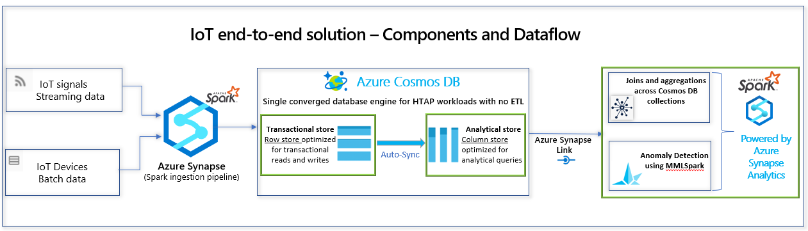

# Azure Synapse Link for Azure Cosmos DB - Samples

<!-- 
Guidelines on README format: https://review.docs.microsoft.com/help/onboard/admin/samples/concepts/readme-template?branch=master

Guidance on onboarding samples to docs.microsoft.com/samples: https://review.docs.microsoft.com/help/onboard/admin/samples/process/onboarding?branch=master

Taxonomies for products and languages: https://review.docs.microsoft.com/new-hope/information-architecture/metadata/taxonomies?branch=master
-->

This Repo contains detailed Synapse Spark sample notebooks that shows end-to-end solutions using Azure Synapse Link for Azure Cosmos DB.

## Scenario 1 - Internet of Things (IoT)
In this scenario, you will ingest streaming and batch IoT data using Azure Synapse Spark into Azure Cosmos DB, perform Joins and aggregations using Azure Synapse Link and perform Anomaly detection using MMLSpark.

There are four sample sample notebooks for the end-to-end IoT use case and they show how to
* Ingest streaming data into Azure Cosmos DB collection using Azure Synapse Spark and Structured Streaming
* Ingest Batch data into Azure Cosmos DB collection using Azure Synapse Spark
* Perform Joins and aggregations across Azure Cosmos DB collections using Azure Synapse Link
* Perform Anomaly Detection with Azure Synapse Link for Cosmos DB and MMLSpark

## Prerequisites
* Azure Cosmos DB account with Azure Synapse Link featured enabled
* Two Azure Cosmos DB analytical store enabled collections 
* Azure Synapse workspace configured with a Spark pool
* Linked Service on Azure Synapse studio with the connection details to the Azure Cosmos DB Database 

## Setup
* Import the four "ipynb" spark notebooks under the "IoT/spark-notebooks/pyspark/" on to the Synapse workspace

## Running the sample
* Attach the Spark pool created in the prerequisite to the spark notebook
* Execute the notebook

## Key concepts
* [Azure Synapse Link for Azure Cosmos DB](https://review.docs.microsoft.com/en-us/azure/cosmos-db/synapse-link?branch=release-build-cosmosdb)
* [Azure Cosmos DB Analytical Store](https://review.docs.microsoft.com/en-us/azure/cosmos-db/analytical-store-introduction?branch=release-build-cosmosdb)
* [Configure Synapse Link for Azure Cosmos DB](https://review.docs.microsoft.com/en-us/azure/cosmos-db/configure-synapse-link?branch=release-build-cosmosdb)
* [Connect to Synapse Link from Synapse Studio](https://review.docs.microsoft.com/en-us/azure/synapse-analytics/synapse-link/how-to-connect-synapse-link-cosmos-db?branch=release-build-synapse)
* [Query Cosmos DB Analytical Store with Synapse Spark](https://review.docs.microsoft.com/en-us/azure/synapse-analytics/synapse-link/how-to-query-analytical-store-spark?branch=release-build-synapse)

## Scenario 2 - Retail Recommendation System

## Contributing

This project welcomes contributions and suggestions.  Most contributions require you to agree to a
Contributor License Agreement (CLA) declaring that you have the right to, and actually do, grant us
the rights to use your contribution. For details, visit https://cla.opensource.microsoft.com.

When you submit a pull request, a CLA bot will automatically determine whether you need to provide
a CLA and decorate the PR appropriately (e.g., status check, comment). Simply follow the instructions
provided by the bot. You will only need to do this once across all repos using our CLA.

This project has adopted the [Microsoft Open Source Code of Conduct](https://opensource.microsoft.com/codeofconduct/).
For more information see the [Code of Conduct FAQ](https://opensource.microsoft.com/codeofconduct/faq/) or
contact [opencode@microsoft.com](mailto:opencode@microsoft.com) with any additional questions or comments.
